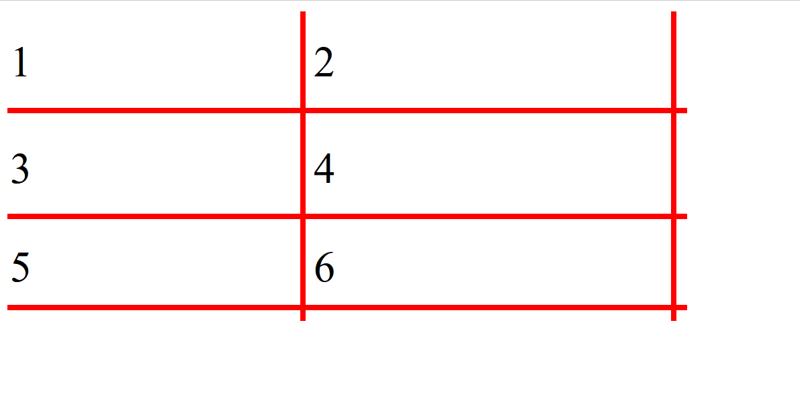

# Resizable React Table

**Please don't use this in production**

This was a fun way of testing if I could build a simple resizable React Table with only a single dependency.

This is the final result:

